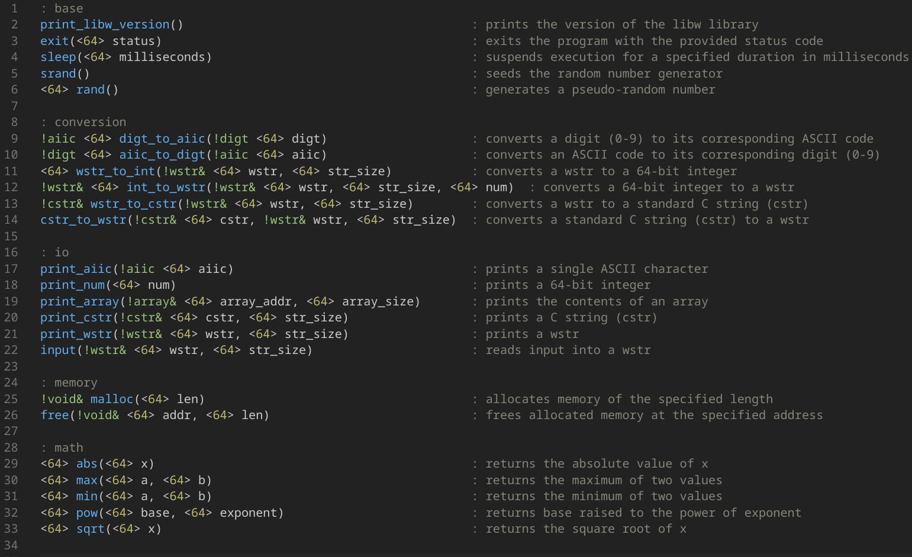

# wlang

wlang is a simple, high-level compiled programming language.    

- The compiler is written in C and translates wlang code into x86_64 GNU assembly. The generated code follows (or attempts to follow) the Linux System V ABI.

- The standard library has been written from scratch in wlang itself and is designed to interface directly with the Linux kernel via system calls, without relying on the C standard library.

- The language is untyped, leaving variable interpretation and management entirely to the developer. Annotations (! followed by a word) can be used to track types, but they are stripped out before compilation.      
Additionnaly, all variables are fixed at 64 bits in size.

- The language offers basic arithmetic, logical, and bitwise operations, along with functions, loops, and conditional branching with if/else. It supports dereferencing, addressing, multifile compilation, macros, and conditional compilation.    

<br>

Below is a preview of the language syntax:


> A Visual Studio Code extension for syntax highlighting is available:  
[https://marketplace.visualstudio.com/items?itemName=eztaah.w](https://marketplace.visualstudio.com/items?itemName=eztaah.w)

<br>

You can find various demonstration programs in the `./demos` directory.

<br>
<br>

## How to Use the Compiler

To compile your wlang code, use the `wlangc` command-line tool (see the section below on building the compiler).

> Dependencies (required when compiling wlang code):    
> - GNU Assembler (as) and Linker (ld): These tools must be installed and accessible via the system's PATH.  
> - C Standard Library (libc): If --no-libc flag is not used, the compiler will dynamically link to libc, assuming it is available on your system. The dynamic linker /lib64/ld-linux-x86-64.so.2 will be added to the executable.

```
$ wlangc --help                                    
Usage:
    wlangc <file.w> [options]     compile a source file with optional flags.
    wlangc --version              display compiler version and exit.
    wlangc --help                 display this help message and exit.

Options:
    -v, --verbose                    output information during compilation
    -d, --define <macro>             define a macro
    --no-libc                        do not link with libc
    --no-libw                        do not link with libw
    --compile-only                   compile only; do not assemble or link
    --no-start-fun                   no _start function, and do not rename main to w__main
    --lib                            create a static library
```

<br>
<br>

## The Standard Library

Available Functions:    


<br>

The goal is to create a standard library that can interface directly with the Linux kernel via system calls, without relying on the libc.     
However, certain functions, such as `malloc` and `free`, have not yet been fully implemented using system calls. As a result, these functions are currently wrappers around the corresponding libc functions.

<br>
<br>

## Building the Compiler from Source

The compiler's source code was developed using a Linux system, and will probably not compile on Windows.

> Dependencies:  
> - gcc    
> - C Standard Library (libc):

building steps:
```sh
cd compiler
make release
```
This command will generate a `wlangc` binary in the root directory of the project.

<br>
<br>

## Building the Standard Library from Source

Before building the standard library, ensure that `wlangc` has been compiled.

> Dependencies:  
> - C Standard Library (libc): Required for compiling libw due to the current implementation of malloc and free. (Refer to "The Standard Library" section for more details.)

building steps:
```sh
cd stdlib
make default
```
This will generate a static library named `libw.a` in the root directory of the project.