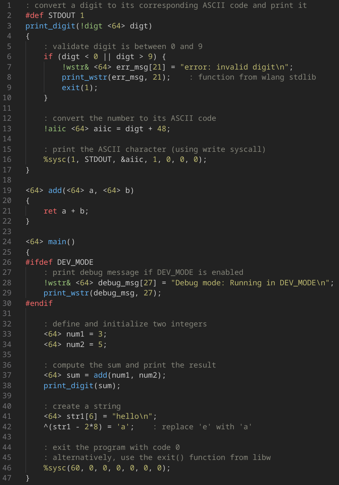

# wlang

The goal is to create a simple high-level programming language.  
The compiler is written in C and translates your high-level code into x86_64 GNU assembly.

```
A ajouter : 
wlangc est un compiler driver, il va gerer le preprocessing, et va aussi utiliser en interne as et ld pour generer l'elf executable. 

Lors du linkage, votre systeme a besoin d'avoir la libc sur son systeme, le linkage est dynamic (la libc n'est pas inclus dans l'executable), link avec ce fichier : ld-linux-x86-64.so.2

Vision : 
    - le compilateur à pour but d'etre le plus simple possible
    - le compilateur ne fournit aucune optimisation
    - aucune volonté de supporter d'autres architecutre (cela compile pour du x86_64 pour linux system)
    - ce language a uniquement un set minimal de feature, (pas de switch, pas de +=, pas de ++, pas de elif), tout ce qui est un wrapper autout d'une fonctionnalité existant n'est pas implementé (pas de [] pour les tableaux).

Infos : 
    - pas de skip avec les operateur || et &&, toutes les expressions sont evaluées (pas de Short-Circuiting Operators)


The generated assembly code follow the linux ABI System V, you can link it with c.


Le compilateur ne sait pas ce qu'il y a dans chaque boites, 
    - Il n'y a donc pas de type checking

    - il n'y a pas de type float, car ajouter le type float dans mon language me forcerais à ajouter un type à chaque boite, car le compilateur aurait besoin de savoir si il doit utiliser le add ou addss lorsqu'il additionne le contenu de la boite. 


Rappel language C : 
Les "type" mis en place sont la uniqument pour empecher au developpeur de faire des erreurs, 
Caster un entier signé dans un entier non signé ne modifie en aucun cas le contentu de la variable, cela modifie juste l'etiquette sur la variable pour dire : "je veux que cette valeur soit interpreté comme un entier non signé", si cette valeur est passé à une fonction qui attend un type signé, il y aura une erreur. MAIS CELA NE CHANGE PAS LE CODE EN ASSEMBLEUR

```

<br>

## Language Syntax

> A Visual Studio Code extension for syntax highlighting is available:  
[https://marketplace.visualstudio.com/items?itemName=eztaah.w](https://marketplace.visualstudio.com/items?itemName=eztaah.w)

<br>

Below is a program that adds two numbers and prints the sum to the terminal:  


Key Points:
- The `return` keyword is mandatory, even if the function returns nothing.
- Functions prefixed with `@` are directly translated to assembly during compilation and do not have "definitions".
- The only existing type is `I64` (a signed 64-bit integer). Keep in mind that you can store ASCII codes and even memory addresses in it. Therefore, it's possible to manipulate characters and addresses.
- Instructions cannot be written outside of functions.

<br>

## How to use the compiler

To compile your code, use the `wlangc` program (see below for building the compiler).

```
$ wlangc --help                                    
Usage:
    wlangc <file.w> [options]     compile a source file with optional flags.
    wlangc --version              display compiler version and exit.
    wlangc --help                 display this help message and exit.

Options:
    -v, --verbose                   output additional information
    -d, --dev-mode                  activate dev mode (add comments in the asm code, ...)
    -e, --to-executable             assemble and link the asmed assembly code into an executable
                                        - GNU assembler (as) and GNU linker (ld) will be needed during compilation time.
                                        - the generated executable will only run on x86_64 architecture and requires a Linux system.
``` 

<br>

## Building the compiler from source

Le compilateur est codé en C, vous avec besoin du compilateur gcc ainsi que de la libc.

Navigate to the project directory and execute this command:
```shell
cd compiler
make release
``` 

A binary named `wlangc` will be generated in your current directory.